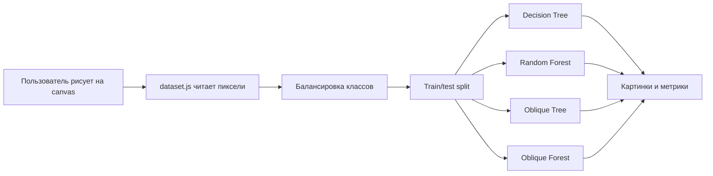
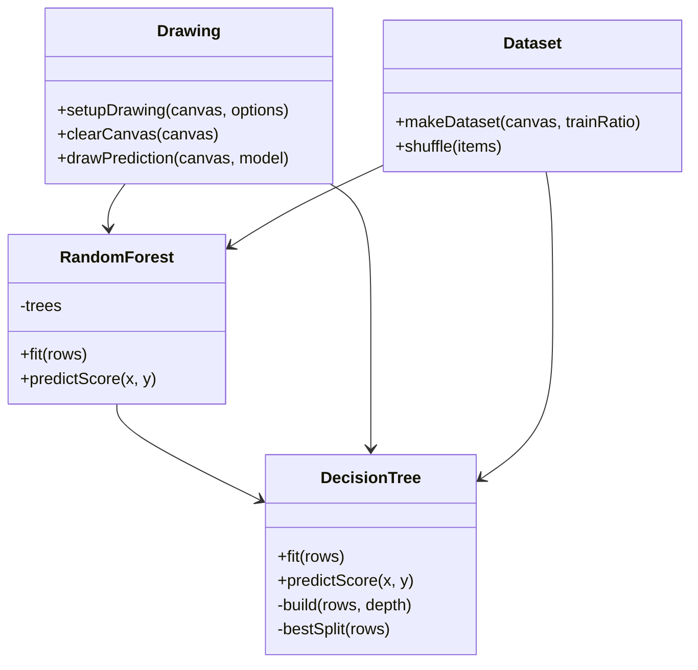

# Визуализация деревьев решений и случайных лесов

Учебный проект про то, как решающее дерево, случайный лес и косые деревья решений делят пространство на классы.

Идея простая: пользователь рисует чёрно-белую картинку на холсте 256 на 256, а модели пытаются повторить её по координатам пикселей. Каждый пиксель становится объектом с признаками `x`, `y` и меткой `label`: `1` для рисунка, `0` для фона.

Сайт: https://iosmoke1.github.io/rf_visualisation/

## Зачем это нужно

Обычно деревья решений объясняют на таблицах. Это правильно, но не всегда наглядно. Здесь задача специально выбрана визуальная: если модель ошиблась, это сразу видно на картинке.

На диагоналях и плавных линиях хорошо видно различие между алгоритмами:

- обычное дерево собирает форму прямоугольными кусками;
- случайный лес усредняет много деревьев и обычно выглядит аккуратнее;
- косые деревья используют разбиения вида `a*x + b*y < c`, поэтому лучше ловят наклонные части рисунка.

## Что есть в проекте

- веб-приложение на обычном JavaScript без React и сборщика;
- реализация дерева решений и случайного леса прямо в браузере;
- поддержка oblique-разбиений;
- ползунки гиперпараметров;
- метрики качества: accuracy, precision, recall, F-мера и confusion matrix;
- Jupyter Notebook с похожей демонстрацией через `sklearn`;
- отчёт в LaTeX и PDF;
- отдельный сценарий для видеопрезентации.

## Как запустить

Проект статический, поэтому его можно открыть прямо в браузере.

```text
index.html
```

Если браузер ругается на локальные файлы, можно поднять простой сервер:

```bash
python -m http.server 8000
```

После этого открыть:

```text
http://localhost:8000
```

## Как пользоваться приложением

1. Нарисовать что-нибудь на холсте.
2. Настроить параметры слева.
3. Нажать `Обучить модели`.
4. Сравнить четыре результата справа.

Лучше всего для демонстрации подходят буквы `V`, `U`, `Z`, диагональные линии, дуги и простые фигуры. На них видно, где обычному дереву не хватает наклонных разбиений.

## Гиперпараметры

- `Доля train`: какая часть точек идёт на обучение, остальное остаётся для проверки.
- `Макс. глубина`: насколько длинной может быть цепочка вопросов в дереве.
- `Минимум в листе`: сколько точек минимум должно остаться в листе.
- `Bootstrap`: размер случайной выборки для каждого дерева в лесу.
- `Количество деревьев`: сколько деревьев обучается в лесу.
- `Направлений для oblique`: сколько наклонных направлений перебирает oblique-дерево.
- `Кисть`: толщина линии на холсте.

## Как это работает внутри

После нажатия на кнопку приложение читает пиксели с canvas. Чёрные и белые пиксели превращаются в строки датасета:

```js
{ x: 0.42, y: 0.73, label: 1 }
```

Фона почти всегда больше, чем рисунка, поэтому данные балансируются: берётся примерно одинаковое число чёрных и белых точек. Потом данные перемешиваются и делятся на train и test.

Дальше каждая модель обучается на train-части. После обучения она заново проходит по всем пикселям холста и для каждого пикселя выдаёт score от `0` до `1`. Если `score >= 0.5`, пиксель становится чёрным, иначе белым.

## Модели

### Decision Tree

Обычное дерево задаёт вопросы вида:

```text
x < c
y < c
```

Такие разбиения дают вертикальные и горизонтальные границы. Поэтому плавные и наклонные линии дерево часто собирает ступеньками.

### Random Forest

Случайный лес обучает много деревьев. Каждое дерево получает свою bootstrap-выборку, а итоговый ответ считается как среднее по деревьям.

```text
score = среднее(score всех деревьев)
```

За счёт этого лес обычно меньше зависит от одного неудачного разбиения.

### Oblique Tree

Косое дерево задаёт вопросы вида:

```text
a*x + b*y < c
```

Это уже не вертикальная или горизонтальная линия, а наклонная прямая. Поэтому oblique-дереву проще описывать диагональные штрихи.

### Oblique Forest

Это лес из oblique-деревьев. Он совмещает две идеи: наклонные разбиения и усреднение многих деревьев.

## Метрики

В интерфейсе показываются:

- `accuracy`: доля всех верных ответов;
- `precision`: сколько закрашенных моделью точек правда относятся к рисунку;
- `recall`: какую часть настоящего рисунка модель нашла;
- `F-мера`: баланс между precision и recall;
- `TP`, `TN`, `FP`, `FN`: таблица ошибок и правильных ответов.

AUC-ROC и AUC-PR здесь специально не используются. Для этой демонстрации важнее бинарный ответ модели и сама форма на картинке, а эти метрики скорее усложнили бы интерфейс.

## Структура проекта

```text
.
├── index.html          # разметка приложения
├── style.css           # стили
├── app.js              # связь интерфейса, моделей и метрик
├── src/
│   ├── drawing.js      # рисование и вывод ответов моделей
│   ├── dataset.js      # чтение canvas и сборка train/test
│   ├── tree.js         # DecisionTree, RandomForest, oblique-разбиения
│   └── metrics.js      # accuracy, precision, recall, F-мера, confusion matrix
├── model_demo.ipynb    # короткая демонстрация через sklearn
├── report.tex          # текст отчёта
├── report.pdf          # собранный отчёт
├── video_script.md     # примерный сценарий видеопрезентации
└── screenshots/        # скриншоты для отчёта
```

## Схема работы



## Упрощённая UML-схема



## Jupyter Notebook

Файл `model_demo.ipynb` показывает ту же задачу в более привычном ML-виде:

- создаётся бинарная картинка;
- пиксели переводятся в таблицу признаков;
- данные делятся на train и test;
- обучаются `DecisionTreeClassifier` и `RandomForestClassifier`;
- идея oblique-разбиений показывается через дополнительные признаки `a*x + b*y`;
- строятся графики и считаются метрики.

Notebook нужен не как копия сайта, а как короткое доказательство, что та же постановка нормально выражается через стандартные библиотеки Python.

## Отчёт и защита

Основной текст лежит в `report.tex`, готовый PDF лежит в `report.pdf`.

В отчёте есть постановка задачи, объяснение решающего дерева, случайного леса, косых деревьев, метрик и связи с приложением. Скриншоты берутся из папки `screenshots`.

Для видеопрезентации есть черновой сценарий в `video_script.md`: первая часть для пользователя, вторая часть для разработчика.

## Ограничения

Это учебная реализация. Она написана так, чтобы алгоритмы можно было прочитать и понять, а не чтобы соревноваться по скорости со `sklearn`.

Из-за этого есть несколько честных ограничений:

- обучение больших лесов может занимать время;
- результат зависит от толщины и сложности рисунка;
- очень тонкий или почти пустой рисунок даёт мало полезных точек;
- oblique-дерево в браузере перебирает ограниченное число направлений.

## Автор

Новолодский Игорь Олегович, курсовой проект по визуализации алгоритмов машинного обучения.
